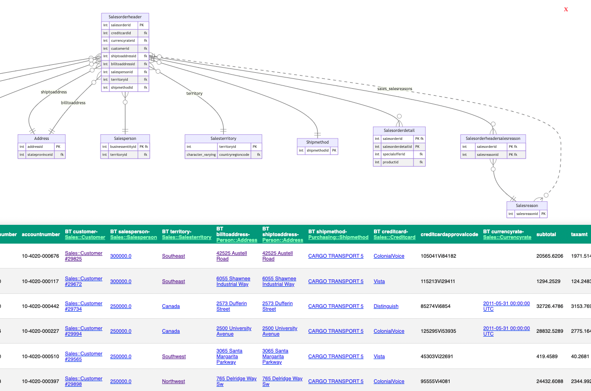
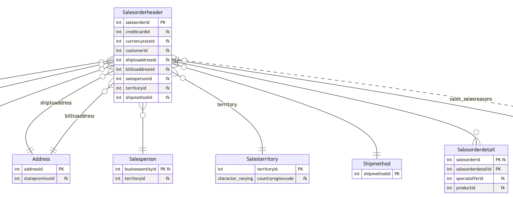
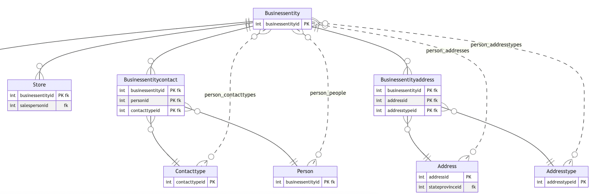
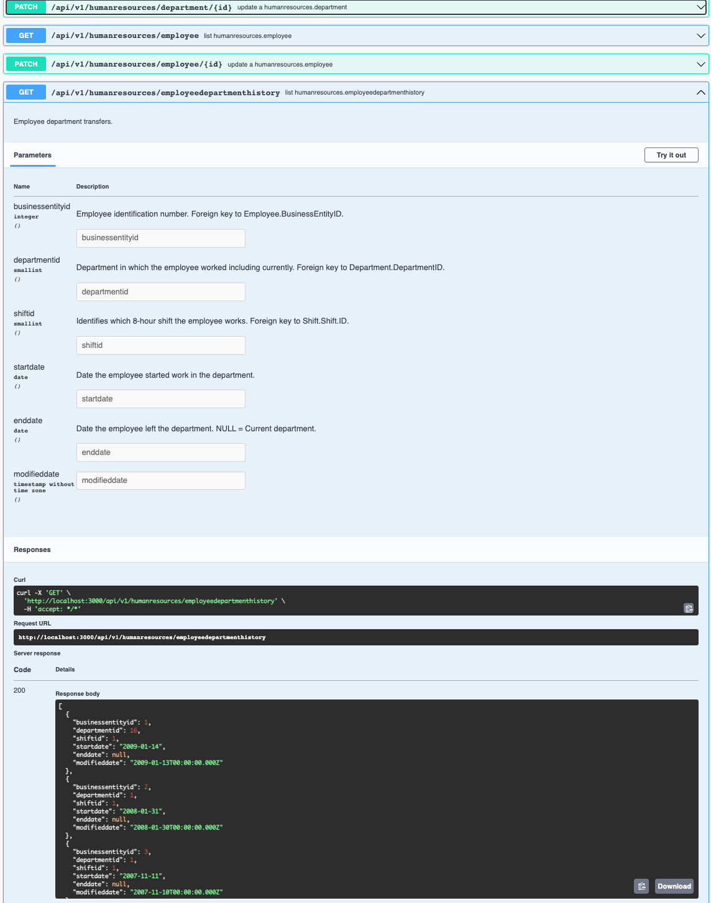

# Build it faster with The Brick!

### Have an instantly-running Rails app from any existing database

Welcome to a seemingly-magical world of spinning up simple and yet well-rounded applications
from any existing relational database!  This gem auto-creates models, views, controllers, and
routes, and instead of being some big pile of raw scaffolded files, they exist just in RAM.
The beauty of this is that if you make database changes such as adding new tables or columns,
basic functionality is immediately available without having to add any code.  General behaviour
around things like having lists be read-only, or when editing is enabled then rules about
how to render the layout -- either inline or via a pop-up modal -- can be established.  More
refined behaviour and overrides for the defaults can be applied on a model-by-model basis.

|  |
|-|

You can use The Brick in several ways -- from taking a quick peek inside an existing data set,
with full ability to navigate across associations -- to easily updating and creating data,
exporting tables or views out to CSV or Google Sheets -- to importing sets of data, even when
each row targets multiple destination tables -- to auto-creating API endpoints -- to creating a minimally-scaffolded application
one file at a time -- to experimenting with various data layouts, seeing how functional a given
database design will be -- and more.

Probably want to pop some corn and have **VOLUME UP** (on the player's slider below) for this
video walkthrough:

https://user-images.githubusercontent.com/5301131/184541537-99b37fc6-ed5e-46e9-9f99-412a03cb2cb1.mp4

## General Overview

| Version        | Documentation                                         |
| -------------- | ----------------------------------------------------- |
| Unreleased     | https://github.com/lorint/brick/blob/master/README.md |
| 1.0.75         | https://github.com/lorint/brick/blob/v1.0/README.md   |

One core goal behind The Brick is to adhere as closely as possible to Rails conventions.  As
such, models, controllers, and views are treated independently.  You can use this tool to only
auto-build models if you wish, and then make your own controllers and views.  Or have The Brick
auto-build controllers and views for some resources as you fine-tune others with custom code.
Any hybrid way you want to mix and mash that is possible.  The idea is to use The Brick to
automatically flesh out the more tedious and simple parts of your application, freeing up your
time to focus on the more tricky bits.

The default resulting pages built out offer "index" and "show" views for each model, with
references to associated models built out as links.  The index page which lists all records for
a given model creates just one database query in order to get records back -- no "N+1" querying
problem common to other solutions which auto-scaffold related tables of data.  This is due to
the intelligent way in which JOINs are added to the query, even when fields are requested which
are multiple "hops" away from the source table.  This frees up the developer from writing many
tricky ActiveRecord queries.

On the "show" page which is built out, CRUD functionality for an individual record can be
performed.  Date and time fields are made editable with pop-up calendars by using the very lean
"flatpickr" library.

In terms of models, all major ActiveRecord associations are built out, including has_many and
belongs_to, as well as has_many :through, Single Table Inheritance (STI), and polymorphic
associations.  Based on the foreign keys found in the database, appropriate belongs_tos are
built, and corresponding has_many associations as well, being inverses of the discovered
belongs_tos.  From there, any tables which are found to only have belongs_to fields are
considered to be "associative" (or "join") tables, and relevant has_many :through associations
are then added.  For example, if there are recipes and ingredients set up with an associative
table like this:

    Recipe --> RecipeIngredient <-- Ingredient

then first there are two belongs_to associations placed in RecipeIngredient, and then two
corresponding has_manys to go the other "inverse" direction -- one in Recipe, and one in
Ingredient.  Finally with RecipeIngredient being recognised as an associative table (as long as
it has no other columns than those two foreign keys, recipe_id and ingredient_id, then in
Recipe a HMT would be added:

    has_many :ingredients, through: :recipe_ingredients

and in Ingredient another HMT would be added:

    has_many :recipes, through: :recipe_ingredients

So when you run the whole thing you could navigate to https://localhost:3000/recipes, and see
each recipe and also all the ingredients which it requires through its HMT.

If either (or both) of the foreign keys were missing in the database, they could be added as an
additional_reference.  Say that the foreign key between Recipe and RecipeIngredient is missing.
It can be provided by putting a line like this in an initialiser file:

    ::Brick.additional_references = [['recipe_ingredients', 'recipe_id', 'recipes']]

If you'd like to have a set of migration files built out from an existing database, that can be
done by running the generator `bin/rails g brick:migrations`.  More detail is found below under
the section "Autogenerate Migration Files".

Brick can auto-create such an initialiser file, and often infer these kinds of useful
references to fill in the gaps for missing foreign keys.  These suggestions are left commented
out initially, so very easily brought into play by editing that file.  Myriad settings are
avaiable therein.

## Table of Contents

<!-- toc -->

- [1. Getting Started](#1-getting-started)
  - [1.a. Compatibility](#1a-compatibility)
  - [1.b. Installation](#1b-installation)
  - [1.c. Displaying an ERD](#1c-displaying-an-erd)
  - [1.d. Exposing an API](#1d-exposing-an-api)
  - [1.e. Using rails g df_export](#1e-using-rails-g-df-export)
  - [1.f. Autogenerate Model Files](#1f-autogenerate-model-files)
  - [1.g. Autogenerate Migration Files](#1g-autogenerate-migration-files)
- [2. More Fancy Exports](#2-limiting-what-is-versioned-and-when)
  - [2.a. Simplify Column Names Using Aliases](#2a-simplify-column-names-using-aliases)
  - [2.b. Filtering the Rows to Export](#2b-filtering-the-rows-to-export)
  - [2.c. Seeing the Resulting JOIN Strategy and SQL Used](#2c-seeing-the-resulting-join-strategy-and-sql-used)
- [3. More Fancy Imports](#3-more-fancy-imports)
  - [3.a. Self-referencing models](#3a-self-referencing-models)
  - [3.b. Polymorphic Inheritance](#3b-polymorphic-inheritance)
  - [3.c. Single Table Inheritance (STI)](#3c-single-table-inheritance-sti)
  - [3.d. Tweaking For Performance](#3d-tweaking-for-performance)
  - [3.e. Using Callbacks](#3e-using-callbacks)
- [4. Similar Gems](#10-similar-gems)
- [Issues](#issues)
- [Contributing](#contributing)
- [Intellectual Property](#intellectual-property)

<!-- tocstop -->

## 1. Getting Started

### 1.a. Compatibility

| brick          | branch     | tags   | ruby     | activerecord  |
| -------------- | ---------- | ------ | -------- | ------------- |
| unreleased     | master     |        | >= 2.3.5 | >= 4.2, < 7.2 |
| 1.0            | 1-stable   | v1.x   | >= 2.3.5 | >= 4.2, < 7.2 |

Brick supports all Rails versions which have been current during the past 8 years, which at
the time of writing (September 2022) includes Rails 4.2.0 and above.  Rails 7.x and 5.x apps work
staightaway with no additional changes.

Rails 6.x uses an interim version of Zeitwerk that is not yet compatible with The Brick, so for
those versions you must use classic mode.  (This is generally the default for Rails 6.0.)  If
you see the error "uninitialized constant _____" then you need to add this line in
application.rb:

    config.autoloader = :classic

In Rails 7 and later the Zeitwerk loader is fully functional, so no autoloader compatibility
issues.  As well Rails 7.0 and 7.1 are the versions which have been tested most extensively.

When used with really old versions of Rails, 4.x and older, Brick automatically applies various
compatibility patches so it will run under newer versions of Ruby.  This makes it easier to
test the broad range of supported versions of ActiveRecord without having to also use older
versions of Ruby.  If you're using Ruby 2.7.5 then any Rails from 4.2 up to 7.1 will work, all
due to the various patches put in place as the gem starts up.  Rails 4.x has not been tested
very extensively, and as well when using those older versions then you MUST have this to be the
last line in boot.rb:

    require 'brick/compatibility'

(Definitely try this patch any time you see the error "undefined method `new' for
BigDecimal:Class (NoMethodError)".)

The Brick notices when some other gems are present and makes use of them -- most notably
**[composite_primary_keys](https://github.com/composite-primary-keys/composite_primary_keys)** which allows very tricky databases to function.
(Try out the [Adventureworks](https://github.com/lorint/AdventureWorks-for-Postgres) sample database to see this in action.) Already when tables and columns are not named in accordance
with Rails' conventions, The Brick does quite a bit to accommodate.  But to get
multiple-column primary and foreign keys to work, then **composite_primary_keys** is
required.  Just bundle it in and The Brick will leverage this gem.

Another notable set of compatibility is provided with the multitenancy gem **[Apartment](https://github.com/influitive/apartment)**.  This is
the most popular gem for setting up multiple tenants where each one uses a different database
schema in Postgres.  The Brick is able to recognise this configuration when you place a line
like this in config/initializers/brick.rb:

    Brick.schema_behavior = { multitenant: {} }

If you provide a sample representative tenant schema that is bound to exist then it gets even
a little smarter about things, being able to auto-recognise models being used on the **has_many**
side of polymorphic associations.  For example, if globex_corp is a schema that has a good
representation of data, then you might want to use this line in the brick initialiser:

    Brick.schema_behavior = { multitenant: { schema_to_analyse: 'globex_corp' } }

The way this auto-polymorphic discovery functions is by analysing all existing types in the
*able_type columns of these associations.  For instance, let's say you have an images table with the
columns `imageable_type` and `imageable_id`, and a goal to have the `Image` model get built out
with `belongs_to :imageable, polymorphic: true`.  In that case to properly establish all the
inverse associations of `has_many :images, as: :imageable` in each appropriate model, then
whatever schema you choose here needs to have data present in those polymorphic columns that
represents the full variety of models that should end up getting the `has_many` side of this
polymorphic association.

A few other gems are auto-recognised in order to support data types such as
[pg_ltree](https://github.com/sjke/pg_ltree)
for hierarchical data sets in Postgres, [RGeo](https://github.com/rgeo/rgeo) for spatial and
geolocation data types, [oracle_enhanced adapter](https://github.com/rsim/oracle-enhanced) for
Oracle databases, and [ActiveUUID](https://github.com/jashmenn/activeuuid) in order
to use uuids with MySQL or Sqlite databases.

### 1.b. Installation

1. Add Brick to your `Gemfile` and bundle.
    ```
    gem 'brick'
    ```
2. To test things, configure database.yml to use Postgres, MySQL, Oracle, Microsoft SQL Server, or Sqlite3, and point to a relational database.  Then from within `bin/rails c` attempt to reference a model by what its normal name might be.  For instance, if you have a `plants` table then just type `Plant.count` and see that automatically a model is built out on-the-fly and the count for this `plants` table is shown.  If you similarly have `products` that relates to `categories` with a foreign key then notice that by referencing `Category` the gem builds out a model which has a **has_many** association called :products.  Without writing any code these associations are all wired up as long as you have proper foreign keys in place.

Even if your table and column names do not follow Rails' conventions, everything still works
because as models are built out then `self.table_name = ` and `self.primary_key = ` entries are
provided as needed.  Likewise, **belongs_to** and **has_many** associations will indicate
which foreign key to use whenever anything is non-standard.  Everything just works.

When running `rails s` you can navigate to the resource names shown during startup.  For instance, here
is a look at a fresh Rails 7 project pointed to an Oracle database loaded with Oracle's OE schema.  This
is a sample database with order entry information.  Some tables in this schema have foreign keys over to
tables in the HR schema as well, and all of the resources you can reference are shown as the `rails s` is
starting up:

```
Lorins-Macbook:example_oracle lorin$ bin/rails s
=> Booting Puma
=> Rails 7.0.4 application starting in development
=> Run `rails server --help` for more startup options

Classes that can be built from tables:
CategoriesTab       /categories_tabs
Customer            /customers
HR::Country         /hr/countries
HR::Department      /hr/departments
HR::Employee        /hr/employees
HR::Job             /hr/jobs
HR::JobHistory      /hr/job_histories
HR::Location        /hr/locations
Inventory           /inventories
Order               /orders
OrderItem           /order_items
ProductDescription  /product_descriptions
ProductInformation  /product_informations
Promotion           /promotions
Warehouse           /warehouses

Classes that can be built from views:
AccountManager        /account_managers
BombayInventory       /bombay_inventories
CustomersView         /customers_views
OcCorporateCustomer   /oc_corporate_customers
OcCustomer            /oc_customers
OcInventory           /oc_inventories
OcOrder               /oc_orders
OcProductInformation  /oc_product_informations
OrdersView            /orders_views
Product               /products
ProductPrice          /product_prices
SydneyInventory       /sydney_inventories
TorontoInventory      /toronto_inventories

Puma starting in single mode...
...
```

From this it's easy to tell where you can navigate to in the browser -- in order to see everything from
`HR::JobHistory`, just navigate to http://localhost:3000/hr/job_histories.

To configure additional options, such as defining related columns that you want to have act as if they were a foreign key, then you can build out an initializer file for Brick.  The gem automatically provides some suggestions for you based on your current database, so it's useful to make sure your database.yml file is properly configured before continuing.  By using the `install` generator, the file `config/initializers/brick.rb` is automatically written out and here is the command:

    bin/rails g brick:install

Inside the generated file many options exist, and one of which is `Brick.additional_references` which defines additional foreign key associations, and even shows some suggested ones where possible.  By default these are commented out, and by un-commenting the ones you would like (or perhaps even all of them), then it is as if these foreign keys were present to provide referential integrity.  If you then start up a `rails c` you'll find that appropriate belongs_to and has_many associations are automatically fleshed out.  Even has_many :through associations are provided when possible associative tables are identified -- that is, tables having only foreign keys that refer to other tables.

### 1.c. Displaying an ERD

It is a bit difficult to fully understand how things are associated by only clicking
through data, going from one resource to the next.  So in order to better grasp how everything is associated, you can show a simple ERD diagram to see associations for the resource you're viewing, such as this glimpse of the Salesorderheader model:



From this we can see that Salesorderheader **belongs_to** Customer, Address, Salesperson,
Salesterritory, and Shipmethod.  Foreign keys for these associations are listed under
Salesorderheader.  The only model associated with a crow's foot designation is at the far
right, and this symbol indicates that for Salesorderdetail there is a **has_many**
association, so the foreign key for this association is found in that foreign table.

Take special note that there are two links to Address -- one called "shiptoaddress" and
the other "billtoaddress".  While not very common, there are times when one record should
be associated to the same model in multiple ways, and as such have multiple foreign keys.
When this is the case, The Brick builds out multiple **belongs_to** associations having
unique names that are derived from the foreign key column names themselves.  Here in
the ERD view it's easy to visualise because when a belongs_to name is not exactly the same
as the resource to which it relates, a label is provided on the links to indicate what name
has been applied.

Opening one of these ERD diagrams is easy -- from any index view click on the ERD icon
located to the right of the resource name.  A partial ERD diagram will open which shows
immediately adjacent models -- that is, models which are up to one hop away via
**belongs_to** and **has_many** associations.  Crow's foot notation indicates the "one
and only one" and "zero to many" sides of each association as appropriate.

Models related via a **has_many :through**, will show with a dashed line, such as seen
here for the lowermost four models associated to BusinessEntity:



(The above diagrams can be seen by installing the Adventureworks sample and navigating to http://localhost:3000/person/businessentities?_brick_erd=1 and http://localhost:3000/sales/salesorderheaders?_brick_erd=1.)

### 1.d. Exposing an API

**The Brick** will automatically create API endpoints with documentation for all tables and views when
it detects that the **[rswag-ui gem](https://github.com/rswag/rswag)** has been configured.
When you have bundled that gem into your project, configuration for RSwag UI can be automatically put
into place by running `rails g rswag:ui:install`, which performs these two actions:
```
  create  config/initializers/rswag_ui.rb
   route  mount Rswag::Ui::Engine => '/api-docs'
```

By default the documentation endpoint expects YAML, and in the interest of broader compatibility with
OpenAPI it was chosen for **The Brick** to instead provide JSON.  So there is a change necessary to
get things going -- open up `rswag_ui.rb` and change .yaml to .json so it looks something like this:
```
Rswag::Ui.configure do |config|
  config.swagger_endpoint '/api-docs/v1/swagger.json', 'API V1 Docs'
end
```

The API itself gets served from `/api/v1/` by default, and you can change that root path if you
wish by going into the Brick initializer file and uncommenting this entry:

```
# ::Brick.api_root = '/api/v1/' # Path from which to serve out API resources when the RSwag gem is present
```

With all of this in place, when you run `bin/rails s` then right before the message about the rack
server starting, you should see this indication:
```
Mounting swagger info endpoint for "API V1 Docs" on /api-docs/v1/swagger.json
```

And then navigating to http://localhost:3000/api-docs/v1 should look something like this:



You can test any of the endpoints with the "Try it out" button.

### 1.f. Autogenerate Model Files

To create a set of model files from an existing database, you can run this generator:

    bin/rails g brick:models

First a table picker comes up where you choose which table(s) you wish to build models for -- by default all the tables are chosen. (Use the arrow keys and spacebar to select and deselect items in the list), then press ENTER and model files will be written into the app/models folder.

Table and column names do not have to adhere to Rails convention -- singular / plural / uppercase / lower / etc. are all valid, and the resulting model files will properly set self.table_name = '....' and primary_key = '...ID' as appropriate.

On associations it sets the class_name, foreign_key, and for has_many :through the source, and inverse_of when any of those are necessary. If they're not needed (which is pretty common of course when following standard Rails conventions) then it refrains.

It also knows how to deal with Postgres schemas, building out modules for anything that's not public, so for a sales.orders table the model class would become Sales::Order, controller is Sales::OrdersController, etc.

Special consideration is made when multiple foreign keys go from one table to another so that unique associations
will be created.  For instance, given Flight and Airport tables where Flight has two foreign keys to Airport,
one to define the departure airport and another for the arrival one, the belongs_to associations would end up
being named **departure_airport** and **arrival_airport**.

### 1.g. Autogenerate Migration Files

If you'd like to have a set of migration files built out from an existing database, that can be done by running this generator:

    bin/rails g brick:migrations

First a table picker comes up where you choose which table(s) you wish to build migrations for -- by default all the tables are chosen. (Use the arrow keys and spacebar to select and deselect items in the list), then press ENTER and new migration files for each individual table in your database are built out either in db/migrate, or if that folder already has .rb files then the destination becomes tmp/brick_migrations.

After successful file generation, the `schema_migrations` table is updated to have appropriate numerical `version` entries, one for each file which was generated.  This is so that after generating, you don't end up seeing the "Migrations are pending" error later.

## Issues
---
If you are using Rails 6.0 or Rails 6.1 and see:

    uninitialized constant _______

(Where _______ is the name of some model or controller class you're hoping to reference) then
in your application.rb file, make sure this configuration setting is in place:

    config.autoloader = :classic

---
If you see an error such as this (note the square brackets around the multiple listed keys specialofferid and productid represented):

    PG::UndefinedColumn: ERROR:  column salesorderdetail.["specialofferid", "productid"] does not exist
LINE 1: ... "sales"."specialofferproduct"."specialofferid" = "sales"."s...

which has been reproduced here by setting up the [Adventureworks database for Postgres](https://github.com/lorint/AdventureWorks-for-Postgres), adding The Brick gem, and then navigating to:

**[http://localhost:3000/sales/salesorderdetails](http://localhost:3000/sales/salesorderdetails)**

then you probably have a table that uses composite keys.  Thankfully The Brick can make use of
the incredibly popular [composite_primary_keys gem](https://github.com/composite-primary-keys/composite_primary_keys), so just add that to your Gemfile as such:

    gem 'composite_primary_keys'

and then bundle, and all should be well.

---
Every effort is given to maintain compatibility with the current version of the Rails ecosystem,
so if you hit a snag then we'd at least like to understand the situation.  Often we'll also offer
suggestions.  Some feature requests will be enteratined, and for things deemed to be outside of
the scope of The Brick, an attempt to provide useful extensibility will be made such that add-ons
can be integrated in order to work in tandem with The Brick.

Please use GitHub's [issue tracker](https://github.com/lorint/brick/issues) to reach out to us.

## Contributing

In order to run the examples, first make sure you have Ruby 2.7.x installed, and then:

```
gem install bundler:1.17.3
bundle _1.17.3_
bundle exec appraisal ar-6.1 bundle
DB=sqlite bundle exec appraisal
```

See our [contribution guidelines][5]

## Setting up for PostgreSQL

You should be able to set up the test database for Postgres with:

    DB=postgres bundle exec rake prepare

And run the tests with:

    bundle exec appraisal ar-7.0 rspec spec

## Setting up for MySQL

If you're on Linux:
```
sudo apt-get install default-libmysqlclient-dev
```

Or on OSX / MacOS with Homebrew:
```
brew install mysql
brew services start mysql
```

On an Apple Silicon machine (M1 / M2 / M3 processor) then also set this:
```
bundle config --local build.mysql2 "--with-ldflags=-L$(brew --prefix zstd)/lib"
```

(and maybe even this if the above doesn't work out)
```
bundle config --local build.mysql2 "--with-opt-dir=$(brew --prefix openssl)" "--with-ldflags=-L$(brew --prefix zstd)/lib"
```


Once the MySQL service is up and running you can connect through socket /tmp/mysql.sock like this:
```
mysql -uroot
```

And inside this console now create two users with various permissions (these databases do not need to yet exist).  Trade out "my_username" with your real username, such as "sally@localhost".

    CREATE USER my_username@localhost IDENTIFIED BY '';
    GRANT ALL PRIVILEGES ON brick_test.* TO my_username@localhost;
    GRANT ALL PRIVILEGES ON brick_foo.* TO my_username@localhost;
    GRANT ALL PRIVILEGES ON brick_bar.* TO my_username@localhost;

    And then create the user "brick" who can only connect locally:
    CREATE USER brick@localhost IDENTIFIED BY '';
    GRANT ALL PRIVILEGES ON brick_test.* TO brick@localhost;
    GRANT ALL PRIVILEGES ON brick_foo.* TO brick@localhost;
    GRANT ALL PRIVILEGES ON brick_bar.* TO brick@localhost;
    EXIT

Now you should be able to set up the test database for MySQL with:

    DB=mysql bundle exec rake prepare

And run the tests on MySQL with:

    bundle exec appraisal ar-7.0 rspec spec

## Setting up for Oracle on a MacOS (OSX) machine

Oracle is the third most popular database solution used for Rails projects in production,
so it only makes sense to have support for this in The Brick.  Starting with version 1.0.69
this was added, offering full compatibility for all Brick features.  This can run on Linux,
Windows, and Mac.

One important caveat for those with Apple M1 or M2 machines is that the low-level Ruby driver
which we rely upon will NOT function natively on Apple Silicon, so on an M1 or M2 machine you
will have to use the Rosetta emulator to run Ruby and your entire Rails app.  In the future when
an Apple Silicon version of Oracle Instant Client ships then everything can work natively.

Before setting up the gems to give support for Oracle in ActiveRecord, there are two necessary
libraries you will need to have installed in order to allow the ruby-oci8 gem to function.
In turn ruby-oci8 is used by oracle_enhanced adapter to give full ActiveRecord support.  Here's
how to get started on a Mac machine that is running Homebrew:

    brew tap InstantClientTap/instantclient
    brew install instantclient-basiclite
    brew install instantclient-sdk

Similar kind of thing on Linux -- install the Basic or Basic Lite version of OCI, and also
the OCI SDK.  With those two libraries in place, you're ready to get the Rails side of things
in order.  Rails has an understanding of the Oracle gem built-in such that if you create a new
Rails app like this:

    rails new brick_app -d oracle

then it automatically puts the main gem in place for you, along with a sample database.yml.

In your Rails project, open your **Gemfile** and confirm that proper database drivers are present:

    gem 'activerecord-oracle_enhanced-adapter'
    gem 'ruby-oci8' # Not needed under Rails 7.x and later
    gem 'brick'

Now bundle, and finally in databases.yml make sure there is an entry which looks like this:

```
development:
  adapter: oracle_enhanced
  database: //localhost:1521/xepdb1
  username: hr
  password: cool_hr_pa$$w0rd
```

You can change **localhost** to be the IP address or host name of an Oracle database server
accessible on your network.  By default Oracle uses port 1521 for connectivity.  The last
part of the database line, in this case **xepdb1**, refers to the name of the database you can
connect to.  If you are unsure, open SQL*Plus and issue this query:

```
SELECT name FROM V$database;
```

The **username** would often refer to the schema you wish to access, or to an account with
privileges on various schemas you are interested in.  The **password** would have been set
up when the user account was first established, and can be reset by logging on as SYSDBA and
issuing this command:

```
ALTER USER hr IDENTIFIED BY cool_hr_pa$$w0rd;
```

This should be all that is necessary in order to have ActiveRecord interact with Oracle.

## Setting up for Microsoft SQL Server on a MacOS (OSX) machine

MSSQL is the fifth most popular database solution used for Rails projects in production, so it
only makes sense to have support for this in The Brick.  Starting with version 1.0.70 this was
added, offering full compatibility for all Brick features.  The client library can run on Linux,
Windows, and Mac.

Before setting up the gems to give support for SQL Server in ActiveRecord, there is a
necessary library you will need to have installed in order to allow the
activerecord-sqlserver-adapter gem to function.  Here's how to get started on a Mac machine
that is running Homebrew:

    brew install freetds
    bundle config set --local build.tiny_tds "--with-opt-dir=$(brew --prefix freetds)"

On Linux it's even simpler -- just install **freetds**.

If you're creating a new application then conveniently Rails already has an understanding of the
SQL Server gem built-in, so if you run this:

    rails new brick_app -d sqlserver

then automatically the main gem is put in place for you, along with a sample database.yml.

In your Rails project, open your **Gemfile** and confirm that proper database drivers are present:

    gem 'activerecord-sqlserver-adapter'
    gem 'tiny_tds'
    gem 'brick'

Now bundle, and finally in databases.yml create an entry which looks like this:

```
development:
  adapter: sqlserver
  encoding: utf8
  username: sa
  password: <%= ENV["SA_PASSWORD"] %>
  host: localhost
```

If your database instance is not the default instance, but instead a named instance, then you
can specify the instance name like this: **localhost\MSSQLSERVER**.

## Intellectual Property

Copyright (c) 2020 Lorin Thwaits (lorint@gmail.com)
Released under the MIT licence.

[5]: https://github.com/lorint/brick/blob/master/docs/CONTRIBUTING.md
